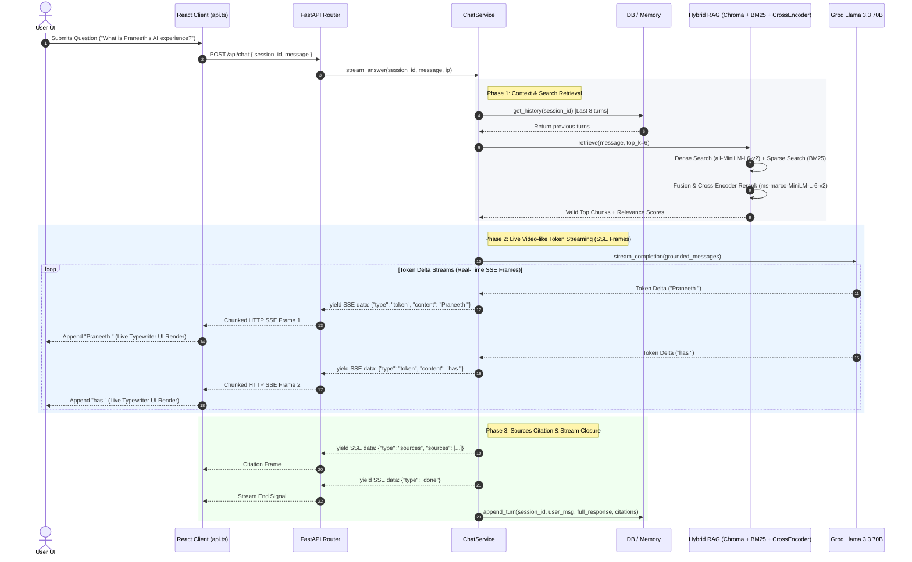

# Praneeth Reddy Ankey — AI & Full-Stack Developer Portfolio

An interactive, AI-powered portfolio application featuring a full-stack architecture with a React + Vite frontend and a FastAPI + RAG (Retrieval-Augmented Generation) backend powered by Groq's Llama 3.3 70B model.

---

## 🌟 Key Features

- **AI Interactive Assistant**: RAG-powered chatbot answering questions about Praneeth's experience, skills, and projects using dense + sparse retrieval (ChromaDB + BM25 + Cross-Encoder Reranker).
- **Modern UI & Aesthetic**: Dynamic dark mode interface built with React, Vite, Tailwind CSS, Lucide icons, and Framer Motion micro-animations.
- **Direct Contact Links**: Clean contact section featuring direct email, phone, location, LinkedIn, and Naukri profile links.
- **Responsive & Performant**: Fully optimized for mobile, tablet, and desktop views.

---

## 🏗️ Full Project Architecture & Live Streaming Data Flow

### 1. High-Level System Architecture Diagram

```mermaid
flowchart TB
    subgraph Client["Frontend Client Layer (React 18 + Vite)"]
        UI["User Interface (Chat Modal / Portfolio Page)"]
        API_CLIENT["API Client (`lib/api.ts`)"]
        STREAM_PARSER["SSE Buffer & Stream Parser (Decoder)"]
        UI -->|User Question / Session ID| API_CLIENT
        API_CLIENT -->|Fetch POST /api/chat| GW
        STREAM_PARSER -->|Incremental Token Callbacks| UI
    end

    subgraph Gateway["FastAPI Application Gateway"]
        GW["FastAPI App Factory (main.py)"]
        MIDDLEWARE["RequestContextMiddleware & CORSMiddleware"]
        RATE_LIMIT["Rate Limiter (Token Bucket / IP Window)"]
        ROUTER["Chat Router (/api/v1/chat)"]
        GW --> MIDDLEWARE --> RATE_LIMIT --> ROUTER
    end

    subgraph RAG_Engine["RAG Orchestration & Processing Layer"]
        SERVICE["ChatService (stream_answer)"]
        ROUTER -->|Delegate Request| SERVICE
        
        subgraph Memory_Layer["Session & Context Memory"]
            PG_MEM["PostgreSQL / AsyncPG (ChatTurn Storage)"]
            CONV_MEM["ConversationMemory (Last 8 Turns)"]
        end
        
        subgraph Hybrid_Retrieval["Hybrid Search Engine"]
            DENSE["Dense Embedding (SentenceTransformers all-MiniLM-L6-v2)"]
            SPARSE["Sparse Index (BM25 rank_bm25)"]
            CHROMA[("ChromaDB Vector Store")]
            FUSION["Score Normalizer & Fusion (0.7 Dense + 0.3 Sparse)"]
        end

        subgraph Precision_Rerank["Anti-Hallucination Reranker"]
            CROSS["Cross-Encoder (ms-marco-MiniLM-L-6-v2)"]
            GUARD["Relevance Floor Guard (MIN_RELEVANCE_SCORE)"]
        end

        subgraph Prompt_Builder["Context Assembly"]
            PROMPT["Prompt Builder (System Grounding + Chunks + History)"]
        end
    end

    subgraph LLM_Provider["External LLM Generation Engine"]
        GROQ["Groq Cloud API (Llama 3.3 70B Versatile)"]
    end

    SERVICE -->|1. Fetch History| CONV_MEM --> PG_MEM
    SERVICE -->|2. Hybrid Retrieve| DENSE & SPARSE
    DENSE --> CHROMA
    DENSE & SPARSE --> FUSION
    FUSION -->|Candidates| CROSS --> GUARD
    GUARD -->|Top Chunks| PROMPT
    PROMPT -->|Messages Payload| GROQ
    GROQ -->|Stream Tokens (HTTP Chunked)| SERVICE
    SERVICE -->|3. Yield SSE Events data: type:token| STREAM_PARSER
    SERVICE -.->|4. Async Persist Turn| PG_MEM
```

---

### 2. Live Data Movement Sequence Diagram (Frame-by-Frame Real-Time Stream)

Like frames in a live video stream, tokens generated by the LLM are packed into SSE frames and transmitted instantly over an unbuffered HTTP stream to the React UI.



---

### 3. Step-by-Step Data Transformation Lifecycle

| Stage | Input Payload | Transformation / Logic | Output Data Payload |
|---|---|---|---|
| **1. UI Request** | Raw User Text + Session UUID | React `fetch()` with `ReadableStream` listener | HTTP `POST /api/chat` JSON body |
| **2. Router & Rate Limit** | Request IP & Session ID | Token bucket check (60 requests/min per IP) | Forwarded Pydantic `ChatRequest` schema |
| **3. Vector & BM25 Search** | Cleaned query string | Dual search: 384D normalized vector similarity + BM25 keyword matching | Fused score candidates list `[0.7 * Dense + 0.3 * Sparse]` |
| **4. Reranking Guardrail** | Candidate chunks + query | Neural Cross-Encoder score calculation (`ms-marco-MiniLM-L-6-v2`) | Filtered relevant chunks (`score >= MIN_RELEVANCE_SCORE`) |
| **5. Prompt Construction** | History + Chunks + Query | System prompt injection forcing strict grounding & anti-hallucination | Message array `[System, History..., User Query + Context]` |
| **6. Live Token Streaming** | Message array | Groq LLM token generation API (`stream=True`) | SSE data frames `data: {"type": "token", "content": "..."}\n\n` |
| **7. UI Video-like Render** | Incoming UTF-8 SSE chunks | TextDecoder line buffer parsing -> `onToken` state update | Real-time typewriter UI re-render |

---

## 🏗️ Directory Layout

```
Praneeth Portfolio/
├── frontend/                     # React + Vite Client Application
│   ├── src/
│   │   ├── components/           # UI Components (Hero, About, Skills, Projects, Contact, Navbar, ChatModal)
│   │   ├── lib/                  # API client (`api.ts` SSE decoder) & utility functions
│   │   ├── pages/                # Index and NotFound pages
│   │   ├── index.css             # Tailwind CSS tokens & glassmorphism styles
│   │   └── App.tsx               # Main application routing
│   ├── public/                   # Static assets & Resume
│   ├── package.json
│   └── vite.config.ts
│
├── backend/                      # FastAPI + AI RAG Engine
│   ├── app/                      # Application routes, models, RAG pipeline, & services
│   │   ├── api/                  # API endpoints & dependency injection
│   │   ├── core/                 # Config, middleware, logging, exception handlers
│   │   ├── models/               # SQLAlchemy ORM models (ChatTurn, Analytics, etc.)
│   │   ├── schemas/              # Pydantic schemas
│   │   ├── services/             # Business logic & RAG engine (embeddings, BM25, reranker, LLM, memory)
│   │   └── utils/                # Text processing & chunking utilities
│   ├── knowledge/                # Markdown Knowledge Base documents
│   ├── data/                     # Vector indices (ChromaDB & BM25)
│   ├── scripts/                  # Knowledge ingestion scripts
│   ├── Dockerfile
│   ├── docker-compose.yml
│   ├── requirements.txt
│   └── .env.example
│
└── README.md                     # Full System Architecture & Data Flow Guide
```

---

## 🛠️ Tech Stack

### Frontend

- **Framework**: React 18 + Vite
- **Styling**: Tailwind CSS + Framer Motion
- **Icons**: Lucide React
- **Toast Notifications**: Sonner

### Backend

- **Framework**: FastAPI (Python 3.11+)
- **LLM Engine**: Groq API (`llama-3.3-70b-versatile`)
- **RAG & Vector DB**: ChromaDB + BM25 + Cross-Encoder Reranker (`ms-marco-MiniLM-L-6-v2`)
- **Database**: PostgreSQL + asyncpg (Alembic for migrations)
- **Deployment & Containers**: Docker & Docker Compose

---

## 🚀 Getting Started Locally

### Prerequisites

- Node.js (v18+) & npm
- Python (v3.10+)
- PostgreSQL (Optional for local dev without DB connection)
- Groq API Key (Free from [Groq Console](https://console.groq.com))

---

### 1. Backend Setup

```bash
cd backend

# Create virtual environment
python -m venv venv
# On Windows:
.\venv\Scripts\activate
# On Linux/macOS:
source venv/bin/activate

# Install dependencies
pip install -r requirements.txt

# Copy environment variables
cp .env.example .env

# Set your Groq API key in .env
# GROQ_API_KEY=gsk_your_groq_api_key

# Run local development server
python main.py
```

The API will run on `http://localhost:8000`.

---

### 2. Frontend Setup

```bash
cd frontend

# Install dependencies
npm install

# Start development server
npm run dev
```

The app will run on `http://localhost:5173`.

---

## 📦 Deployment Instructions

### Frontend (Vercel)

1. Import the repository into **Vercel**.
2. Set the **Root Directory** to `frontend`.
3. Add Environment Variable:
   - `VITE_API_URL` = `https://your-backend-api.onrender.com`
4. Click **Deploy**.

### Backend (Render / Railway / Docker)

1. Deploy the `backend/` directory to **Render**, **Railway**, or any Docker-compatible server.
2. Set environment variables:
   - `GROQ_API_KEY`: Your Groq API key
   - `DATABASE_URL`: PostgreSQL connection string
   - `CORS_ORIGINS`: Your Vercel frontend URL
