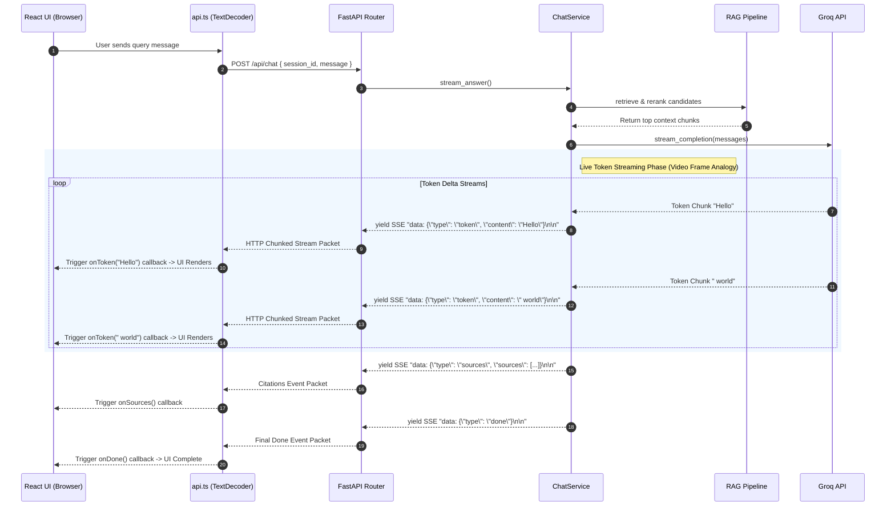

# AI Portfolio Backend

Production-ready FastAPI backend for a personal AI portfolio site. Provides contact form
handling, project listings, resume download, self-hosted analytics, and a production-grade
hybrid-retrieval RAG chatbot powered by Groq's Llama 3.3 70B.

## 🏗️ Architecture & Data Movement Flow

### High-Level Service & Layer Architecture

```mermaid
flowchart TD
    subgraph ClientLayer["Frontend Client"]
        Client["React Web UI (Chat Component)"]
        Fetch["fetch() with ReadableStream Parser"]
        Client -->|POST /api/chat { session_id, message }| Fetch
    end

    subgraph APILayer["FastAPI Gateway (app/api/v1/chat.py)"]
        Middleware["RequestContextMiddleware"]
        RateLimiter["Rate Limiter (Token Bucket per IP)"]
        ChatRouter["Chat Router Endpoint"]
        Fetch --> Middleware --> RateLimiter --> ChatRouter
    end

    subgraph ServiceLayer["Service & RAG Pipeline (app/services/rag/)"]
        ChatService["ChatService.stream_answer()"]
        ChatRouter -->|Delegate Request| ChatService
        
        subgraph Stage1["1. Context & History Retrieval"]
            Memory["ConversationMemory (Postgres ChatTurn DB)"]
            ChatService -->|Load History| Memory
        end
        
        subgraph Stage2["2. Hybrid Search Engine"]
            HybridRetriever["HybridRetriever"]
            Embeddings["Dense Embeddings (all-MiniLM-L6-v2)"]
            ChromaDB[("ChromaDB Vector Index")]
            BM25["Sparse Keyword Search (rank_bm25)"]
            
            ChatService -->|Query| HybridRetriever
            HybridRetriever --> Embeddings --> ChromaDB
            HybridRetriever --> BM25
        end

        subgraph Stage3["3. Reranking & Guardrails"]
            CrossEncoder["CrossEncoder (ms-marco-MiniLM-L-6-v2)"]
            RelevanceCheck["Relevance Floor Guard (MIN_RELEVANCE_SCORE)"]
            
            HybridRetriever -->|Fused Candidates| CrossEncoder --> RelevanceCheck
        end

        subgraph Stage4["4. Grounded Prompt & Generation"]
            PromptBuilder["Prompt Builder"]
            LLMClient["LLM Client (Groq SDK stream=True)"]
            
            RelevanceCheck -->|Verified Context Chunks| PromptBuilder
            PromptBuilder -->|Formatted System + User Prompt| LLMClient
        end
    end

    subgraph ExternalProvider["Groq Cloud LLM Engine"]
        GroqAPI["Llama 3.3 70B Model Engine"]
        LLMClient <-->|Stream HTTP Chunked Response| GroqAPI
    end

    subgraph SSEStream["Live Unbuffered Event Stream"]
        TokenFrame["data: {'type': 'token', 'content': '...'}"]
        SourcesFrame["data: {'type': 'sources', 'sources': [...]}"]
        DoneFrame["data: {'type': 'done'}"]
        
        LLMClient --> TokenFrame
        ChatService --> SourcesFrame --> DoneFrame
    end

    TokenFrame & SourcesFrame & DoneFrame -->|Live Stream to React| Fetch
```

---

### Real-Time Live Streaming Workflow (Frame-by-Frame Data Movement)

Like streaming frames in a live video feed, token chunks produced by Groq are formatted as Server-Sent Events (SSE) and streamed over an unbuffered HTTP connection directly to the React state.



---

### RAG Pipeline Component Matrix (`app/services/rag/`)

| Stage | Module | Details |
|---|---|---|
| Chunking | `utils/text_processing.py` | `RecursiveCharacterTextSplitter`, chunk_size=700, overlap=100 |
| Dense embeddings | `embeddings.py` | `sentence-transformers/all-MiniLM-L6-v2`, normalized, cosine sim |
| Vector store | `vector_store.py` | ChromaDB persistent collection |
| Sparse retrieval | `sparse_retriever.py` | BM25 (`rank_bm25`), persisted via pickle |
| Hybrid fusion | `hybrid_retriever.py` | `0.7 * dense + 0.3 * sparse` (configurable) |
| Reranking | `reranker.py` | `cross-encoder/ms-marco-MiniLM-L-6-v2` |
| Prompt building | `prompt_builder.py` | Grounded, anti-hallucination system prompt |
| Generation | `llm_client.py` | Groq (`llama-3.3-70b-versatile`) via OpenAI-compatible SDK, streamed |
| Memory | `memory.py` | Last 8 turns persisted per session in Postgres |
| Orchestration | `chat_service.py` | Ties it all together, emits SSE events |

**Anti-hallucination guardrails:**
1. If hybrid retrieval returns zero candidates → canned "I don't know" response, no LLM call.
2. Reranked candidates below `MIN_RELEVANCE_SCORE` are discarded.
3. System prompt explicitly forbids answering outside the provided context.

Every response includes **source citations** (file + section + snippet + relevance score).

## Getting Started

### 1. Local development (without Docker)

```bash
python -m venv .venv && source .venv/bin/activate
pip install -r requirements.txt

cp .env.example .env
# Edit .env: set GROQ_API_KEY, DATABASE_URL, etc.

# Start Postgres (locally or via `docker compose up db -d`)
alembic upgrade head

# Ingest the knowledge base (also happens lazily on first app startup)
python -m scripts.ingest_knowledge

uvicorn app.main:app --reload
```

API docs: http://localhost:8000/api/docs (Swagger) or `/api/redoc`.

### 2. Docker Compose (recommended)

```bash
cp .env.example .env   # fill in GROQ_API_KEY at minimum
docker compose up --build
```

This starts the API, Postgres, and Redis. On first boot, if the vector store is empty, the
app automatically ingests `knowledge/` (see `app/main.py` lifespan). To force a clean re-index
after editing knowledge files:

```bash
docker compose exec api python -m scripts.ingest_knowledge --force
```

### 3. Database migrations

```bash
alembic upgrade head                                   # apply migrations
alembic revision --autogenerate -m "add new field"      # generate a new migration
```

## API Endpoints

| Method | Path | Description |
|---|---|---|
| GET | `/api/health` | Liveness probe |
| GET | `/api/health/ready` | Readiness probe (checks DB) |
| POST | `/api/contact` | Submit contact form |
| GET | `/api/projects` | List projects (`?category=`, `?featured_only=`) |
| GET | `/api/projects/{slug}` | Get one project |
| GET | `/api/resume/download` | Download resume PDF |
| POST | `/api/analytics/events` | Track a frontend event |
| GET | `/api/analytics/summary` | Aggregate analytics (`?range_days=`) |
| POST | `/api/chat` | RAG chatbot — **streams SSE** |

Full interactive documentation is auto-generated at `/api/docs`.

### Chat endpoint (SSE) contract

**Request**
```json
{ "session_id": "client-generated-uuid-or-string", "message": "What's your tech stack?" }
```

**Response** — `text/event-stream`, each `data:` line is a JSON object:
```
data: {"type": "token", "content": "I primarily "}
data: {"type": "token", "content": "work with FastAPI..."}
data: {"type": "sources", "sources": [{"source": "skills.md", "section": "Backend Development", "snippet": "...", "relevance_score": 0.91}]}
data: {"type": "done"}
```
On error: `{"type": "error", "error": "..."}` followed by `{"type": "done"}`.

Frontend integration (React/fetch example):
```ts
const response = await fetch("/api/chat", {
  method: "POST",
  headers: { "Content-Type": "application/json" },
  body: JSON.stringify({ session_id, message }),
});
const reader = response.body!.getReader();
const decoder = new TextDecoder();
// Parse SSE `data: {...}\n\n` frames from the stream as they arrive.
```

## Configuration

All configuration lives in `app/core/config.py` (Pydantic Settings) and is populated from
environment variables — see `.env.example` for every available option, including hybrid
retrieval weights, chunk size/overlap, rate limits, and model names.

## Editing Portfolio Content

- **Projects:** edit `app/data/projects.json` (no migration needed).
- **Chatbot knowledge:** edit/add Markdown files under `knowledge/`, then re-run
  `python -m scripts.ingest_knowledge --force`.
- **Resume:** place your PDF at `static/resume.pdf` (path configurable via `RESUME_FILE_PATH`).

## Testing

```bash
pytest
```

Included tests cover health, project listing, and contact validation without requiring the
ML models to load. For full RAG pipeline testing, add integration tests that pre-warm the
embedding/reranker singletons (they're cached via `lru_cache`, so the cost is paid once).

## Future Expansion (seams already in place)

- **Authentication:** protect `/api/analytics/summary` and any future admin endpoints with
  JWT/OAuth2 — `app/core/` is the natural home for a `security.py` module.
- **Redis caching:** `REDIS_ENABLED` and `REDIS_URL` are already in config;
  `app/core/rate_limit.py` documents the swap from in-memory to Redis-backed limiting.
- **pgvector:** `VectorStore` in `services/rag/vector_store.py` is the only module that would
  need to change to move from ChromaDB to Postgres + pgvector — the rest of the pipeline is
  agnostic to the vector backend.

## Deployment Notes

- The Docker image pre-downloads the embedding and reranker models at build time to avoid
  cold-start download latency; comment that step out in `Dockerfile` if you'd rather keep the
  image smaller and accept a slower first request.
- Run a single Uvicorn worker per container (see comment in `Dockerfile`) and scale
  horizontally with multiple container replicas instead of `--workers N`, since each worker
  process would otherwise load its own copy of the ML models into memory.
- `data/chroma` and `data/bm25` are mounted as Docker volumes so indices persist across
  container restarts/redeploys.
